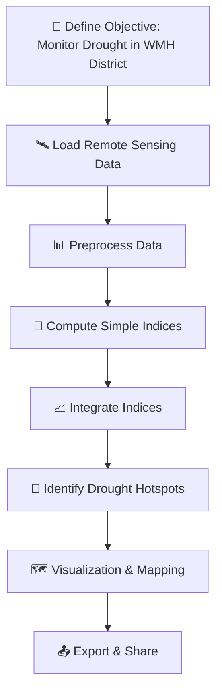

# Drought Monitoring Workflow for WMH District

This repository provides a structured workflow for **monitoring drought conditions in the WMH District** using multi-source remote sensing and climate data. The process integrates vegetation, temperature, soil moisture, and rainfall indices to identify drought hotspots and generate actionable maps.

---

## Workflow Overview

---

### Step-by-step Breakdown

#### 1. **Define Objective**
   - Monitor drought severity and spatial dynamics in WMH District.

#### 2. **Load Remote Sensing Data**
   - **MODIS NDVI (250 m):** Vegetation status 🌱
   - **MODIS LST (1 km):** Land Surface Temperature 🌞
   - **CHIRPS Rainfall:** Precipitation 💧
   - **ERA5 Soil Moisture:** Surface soil moisture 💦

#### 3. **Preprocess Data**
   - Clip datasets to Area of Interest (AOI) 🗺️
   - Convert LST from Kelvin to Celsius 🌡️
   - Scale NDVI & Rainfall values for analysis

#### 4. **Compute Simple Indices**
   - **Vegetation Condition Index (VCI) 🌱**
   - **Temperature Condition Index (TCI) 🌞**
   - **Soil Moisture Condition Index (SMCI) 💦**
   - **Precipitation Condition Index (PCI) ☔**

#### 5. **Integrate Indices**
   - **Vegetation Health Index (VHI):**  
     `VHI = (VCI + TCI)/2` 🔥
   - **Normalized Drought Index (NDDI):**  
     `NDDI = (NDVI - NDWI)/(NDVI + NDWI)` 🌾

#### 6. **Identify Drought Hotspots**
   - Areas where `VHI < 40` are flagged as high-risk drought zones 📌

#### 7. **Visualization & Mapping**
   - Generate color-coded maps (Red = Severe, Green = Healthy) 🎨
   - Temporal analysis for the year **2023** 📆

#### 8. **Export & Share**
   - Export Raster GeoTIFFs 🌐
   - Drought hotspot layers 🗺️
   - Maps for further GIS analysis 🖥️

---

## Author

Tejas Chavan  
* GIS Expert at Government Of Maharashtra Revenue & Forest Department  
* tejaskchavan22@gmail.com  
* +91 7028338510  

---